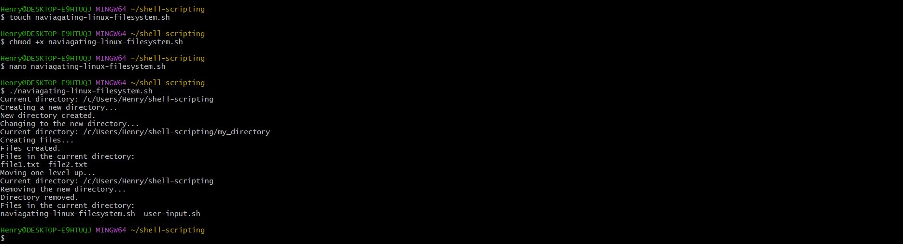

**SHELL SCRIPTING**

- (1) *Variables* 

  Asigning value to variable and retrieving it *name="John"* *echo $name*

  

-  (2) *Control Flow*

    Using if-slse to execute scripts .  Example is a script to check if a number is positive, negative, or zero:

    

-  Another Example is a script to print numbers from 1 to 5 using a for loop. 

    

- (3)  *Command Substitution* Example is a script to capture curent date and use same as value . 

  

  Result is 

  

  
  
  - **WRITING MY FIRST SHELL SCRIPT**.
- I created a directory called **shell_scripting** usind  **mkdir command** and Cd inside it

- Using *touch* command, i created a file inside the directory called **user-input.sh**
-  Using **nano** cammand, i pasted the scrip code inside.
-  Using **ctl+O and Ctl +x** , I saved the script
-  To make the file executable, I run **Chmod +x user-input.sh**

-  Using the command **./user-input.sh** to run the script

    

- **DIRECTORY MANIPULATION AND NAVIGATION**

-  I followed the same process above and got the following result 

    

-
    **FILE OPERATIONS AND SORTING** 

    

  

-  **WORKING WITH NUMBERS AND CALCULATONS**

    

    **FILE BACKUP AND TIMESTAMPING**

-  I replaced the souce directory and my backup directory   before pasting the code

     

     

    